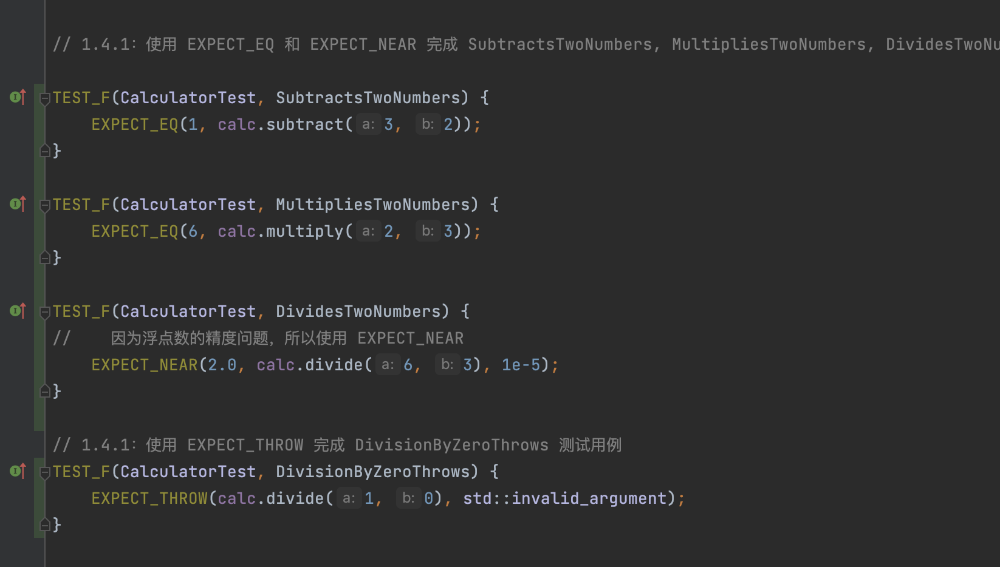

# 软件测试实验报告

> 姓名：周荪奕
> 学号：221220001

报告使用 Markdown / Word 提交均可，需包含以下内容。

## 1 C++ 单元测试

### 1.1 实验环境
操作系统：MacOS 15.2
Soc: Apple M1 Pro

### 1.2 实验内容

#### 1.1.1 创建第一个单元测试

#### 1.1.2 值参数化测试

...

### 1.3 思考与体会

回答每个实验内容下给出的思考题，给出自己的理解。

## 2 Java 单元测试
### 2.1 实验环境

IDE：IntelliJ IDEA 
JDK：OpenJDK 22.0.1 aarch64

### 实验内容

## 3 Web 测试
### 3.1 实验环境
Python 3.9.13
Selenium 4.27.1

## 4 移动应用测试
### 4.1 实验环境
这个实验的环境比较复杂，需要配置adb,android sdk, appium等工具。