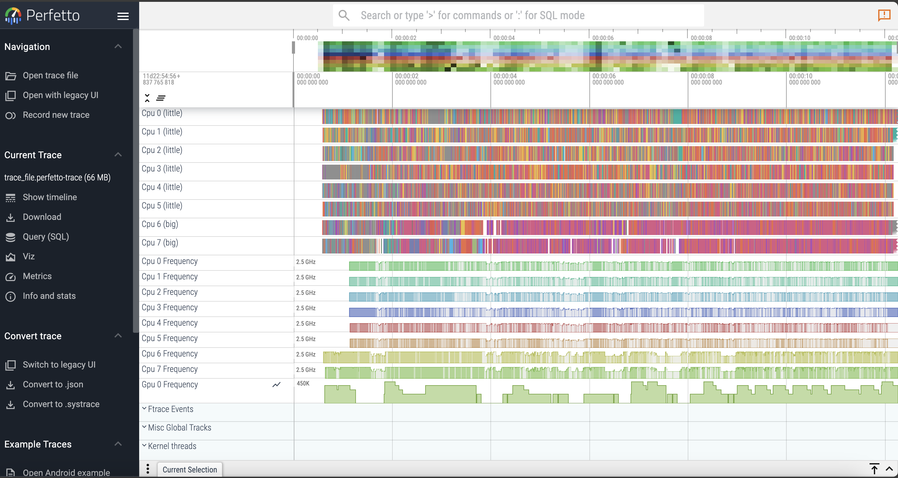
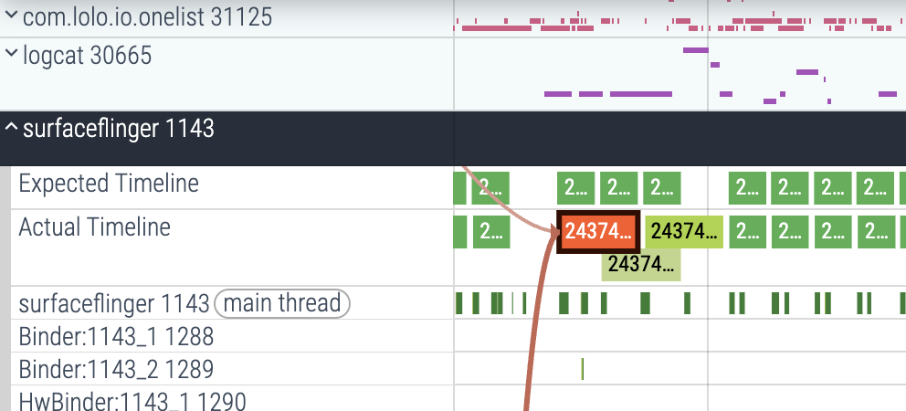

# 软件测试实验报告

> 姓名：周荪奕
> 学号：221220001

## 1 C++ 单元测试

### 1.1 实验环境
操作系统：MacOS 15.2
Soc: Apple M1 Pro

### 1.2 实验内容

#### 1.1.1 创建第一个单元测试


#### 1.1.2 值参数化测试

...

### 1.3 思考与体会
1. 除了 1.4.1 中使用的EXCEPT 断言，还有什么场景更适合使用 ASSERT 断言？
ASSERT失败时，程序会直接终止，而EXCEPT失败时，程序会继续执行。因此，对于一些不可恢复的错误，比如内存分配失败，应该使用ASSERT断言，而实际生产中，应该使用EXCEPT断言。
2. 在 1.4.3 所述的值参数化测试中，如果输入参数的全排列面临组合爆炸问题，你有什么策略减少测试用例数量？
因子组合测试、正交数组等方法。
1. 在 1.4.4 所述类型参数化测试中，如何处理类型之间行为的差异？

## 2 Java 单元测试
### 2.1 实验环境

IDE：IntelliJ IDEA 
JDK：OpenJDK 22.0.1 aarch64

### 实验内容


## 3 Web 测试
### 3.1 实验环境
Python 3.9.13
Selenium 4.27.1
### 3.2 实验内容

### 3.3 思考与体会
1. 如果在该在线购物网站中加入了优惠券系统（限定使用时间内满x元减y元），将会需要哪些额外的功能性测试？请列出具体测试用例。
需要测试优惠券的有效性、优惠券的使用时间、优惠券的使用条件、优惠券的使用次数等。
如：优惠券能否正常领取，过期优惠券是否能正常使用，未达到x元能否使用，达到后是不是正确的减了y元等。
## 4 移动应用测试
### 4.1 实验环境
这个实验的环境比较复杂，需要配置adb,android sdk, appium等工具。
由于perfetto的使用较为复杂，我们没有进行性能测试。只进行了功能测试。
### 4.2 实验内容
### 4.2.1 功能测试

### 4.2.2 性能测试
#### 使用 Perfetto 进行性能测试
```shell
./record_android_trace -o trace_file.perfetto-trace -c config.pbtx
```
这段代码是用来记录trace的，其中`-o`参数指定输出文件，`-c`参数指定配置文件。
给定的config.pbtx中有两个参数不被我们的设备支持，于是我们将其注释掉。运行这段代码后会浏览器会自动打开我们的trace文件。大致如下：

接下来我们分析帧渲染，找到SurfaceFlinger这个进程

我们发现在这里，它的实际渲染时间大于了期望渲染时间。它有两个Preceding flows，一个来自com.lolo.io.onelist，一个来自com.sohu.inputmethod.sogou，那么这里大概率是由于资源争夺或进程间通信导致的。
### 4.3 思考与体会
在 4.4.1 的标记项目完成测试用例 test_mark_item_done 中， Appium 本身无法通过 UIAutomator2 获取文本的颜色、删除线等样式信息，此时该如何完成此测试用例？
可以通过计算机视觉的方法，识别屏幕截图；
由于被标记为完成的任务会被移动到列表底部，可以通过元素的下标来检查（原来是第0个，后来变成的第1个）。